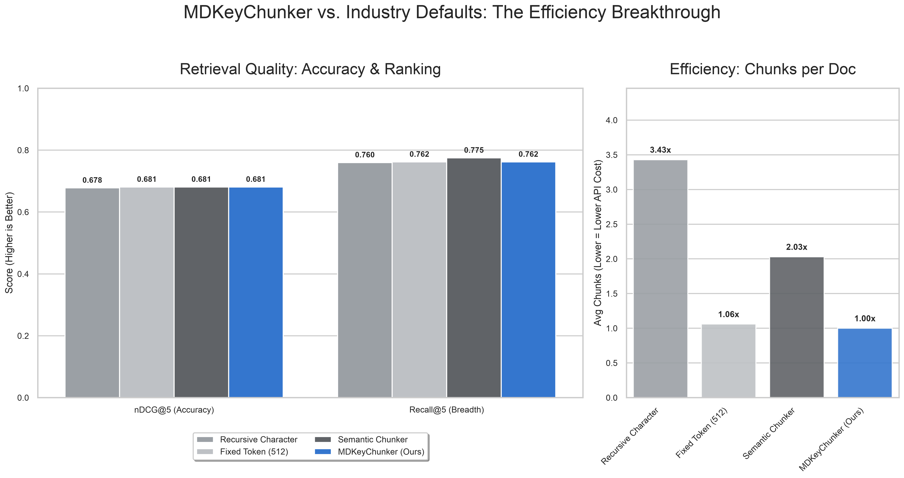

# MDKeyChunker

[](https://pypi.org/project/mdkeychunker/)
[](https://www.python.org/downloads/)
[](https://opensource.org/licenses/MIT)
[](https://arxiv.org/abs/2603.23533)

Markdown chunking with single-call LLM enrichment or ultra-fast spaCy processing for RAG pipelines. 
Paper: **[MDKeyChunker: What Does One LLM Call per Chunk Buy for Markdown Retrieval?](https://arxiv.org/abs/2603.23533)** (arXiv:2603.23533)

## What It Does

1. **Chunks** Markdown into structural units (headers, code blocks, tables, lists)
2. **Enriches** each chunk with ONE call → title, summary, keywords, entities, questions, semantic key
    - **LLM Mode**: High-fidelity metadata using GPT/Claude/Ollama
    - **spaCy Mode**: Fast, local, and free semantic key extraction
3. **Passes rolling keys** forward so the enricher has context about prior topics
4. **Restructures** by merging chunks that share the same specific-subtopic key

## Quick Start

```bash
pip install mdkeychunker                 # add [anthropic] or [spacy] extras as needed
export LLM_API_KEY=...                   # or LLM_BASE_URL for Ollama/vLLM; see .env.sample
mdkeychunker your_document.md
```

spaCy mode needs the extra and a model: `pip install "mdkeychunker[spacy]" && python -m spacy download en_core_web_md`.
To work on the code: `git clone https://github.com/bhavik-mangla/MDKeyChunker.git && pip install -e ".[dev]"`.

Or programmatically:

```python
from mdkeychunker import Pipeline, Config

# High-fidelity mode (GPT-4o-mini)
config = Config.from_env()
pipeline = Pipeline(config, enricher_mode="llm")
chunks = pipeline.process_file("document.md")

# Ultra-fast / Free mode (spaCy)
pipeline_fast = Pipeline(config, enricher_mode="spacy")
chunks_fast = pipeline_fast.process_file("document.md")
```

## CLI

```bash
# Basic usage
mdkeychunker document.md

# Save to specific output
mdkeychunker document.md -o chunks.jsonl

# With summary file and stats
mdkeychunker document.md --summary summary.txt --stats

# Disable merging
mdkeychunker document.md --no-merge

# Override LLM provider (e.g., local Ollama)
mdkeychunker document.md --provider openai_compatible --base-url http://localhost:11434/v1 --model llama3
```

## Configuration

Set via `.env` file or environment variables:

| Variable | Default | Description |
|---|---|---|
| `LLM_PROVIDER` | `openai` | `openai` \| `anthropic` \| `openai_compatible` |
| `LLM_API_KEY` | — | API key (not needed for local Ollama) |
| `LLM_BASE_URL` | — | Base URL for Ollama/vLLM/LM Studio |
| `LLM_MODEL` | `gpt-4o-mini` | Model name |
| `MIN_CHUNK_SIZE` | `100` | Minimum characters per chunk |
| `MAX_CHUNK_SIZE` | `1500` | Soft max characters per chunk |
| `MERGE_BY_KEYS` | `true` | Merge chunks sharing the same key |
| `MAX_MERGED_SIZE` | `3000` | Max combined size after merging |
| `MIN_ORPHAN_SIZE` | `200` | Below this, orphan chunks get context enrichment |
| `LOG_LEVEL` | `INFO` | Logging verbosity |

## LLM Providers

```bash
# OpenAI
LLM_PROVIDER=openai
LLM_API_KEY=sk-...
LLM_MODEL=gpt-4o-mini

# Anthropic
LLM_PROVIDER=anthropic
LLM_API_KEY=sk-ant-...
LLM_MODEL=claude-3-haiku-20240307

# Ollama (local)
LLM_PROVIDER=openai_compatible
LLM_BASE_URL=http://localhost:11434/v1
LLM_MODEL=llama3
```

## How It Works

```
Markdown → Chunker → Enricher (1 LLM call/chunk) → Restructurer → Enriched Chunks
                          ↑
                    Rolling Keys
                    (context from prior chunks)
```

**Key design**: The `key` field means the *specific subtopic* that distinguishes a chunk — e.g. `"admissions process"`, `"oauth token flow"`, `"gradient descent optimization"` — never the broad document topic. Chunks with matching keys are merged globally, regardless of position.

## Chunk Schema

```json
{
  "chunk_id": "a3f2b1c4d5e6f7a8",
  "text": "The admissions process begins in March...",
  "section_title": "Admissions",
  "title": "Spring Admissions Timeline",
  "summary": "Describes the March start of the admissions process...",
  "keywords": ["admissions", "application deadline", "March intake"],
  "entities": [{"name": "March", "type": "EVENT"}],
  "questions": ["When does the admissions process begin?"],
  "key": "admissions process",
  "related_keys": ["curriculum framework"],
  "content_types": ["paragraph"],
  "position_index": 2,
  "previous_chunk_id": "9b8c7d6e5f4a3b2c",
  "next_chunk_id": "1a2b3c4d5e6f7a8b",
  "token_count": 187,
  "start_line": 12,
  "end_line": 28
}
```

## What the evaluation found

The v3 paper evaluates each stage on two public datasets (Qasper and FreshStack
Laravel docs) with `qwen2.5:7b`, four retrievers, and an analysis plan committed
before results. In short:

- **Structure-aware chunking (Stage 1, no LLM) is the main win**: it beats
  512-character windows on both datasets.
- **One LLM call per chunk (Stage 2) showed no measurable retrieval gain** over a
  free section-path prefix or over contextual retrieval on the main retrievers;
  it helped only with BM25 alone on Qasper and with an embedder that truncates
  long inputs.
- **Rolling keys make keys about 3x more consistent**, but merging on keys
  (Stage 3) did not improve retrieval.

If you only need retrieval quality, structure-aware chunking alone is the cheap
default (no LLM calls):

```python
from mdkeychunker import Config
from mdkeychunker.chunker import MarkdownChunker

chunks = MarkdownChunker(Config()).chunk(markdown_text)
# prefix each chunk's text with chunk.section_title for a free title-chain index
```

Enrichment is most useful when you want the metadata itself (titles, summaries,
questions) or retrieve with BM25.
Harness, plan and per-question results: [`benchmarks/chunking_study/`](benchmarks/chunking_study/).

## Benchmarks

The paper's evaluation (30 queries over an 18-document Markdown corpus, Configs A–D) is described in [arXiv:2603.23533](https://arxiv.org/abs/2603.23533). The code version used in the paper is commit `e3e1b86`.

`benchmarks/scifact.py` runs a SciFact sanity check in spaCy mode (`pip install -e ".[benchmark,spacy]"`, then `python benchmarks/scifact.py`). Embeddings are [BAAI/bge-small-en-v1.5](https://huggingface.co/BAAI/bge-small-en-v1.5) with exact cosine search.



| Strategy | Library | Recall@5 | nDCG@5 | Chunks/Doc |
| :--- | :--- | :--- | :--- | :--- |
| MDKeyChunker (spaCy mode) | — | 0.762 | 0.681 | 1.00 |
| [Recursive Character](https://github.com/langchain-ai/langchain) | LangChain | 0.760 | 0.678 | 3.43 |
| [Semantic Chunker](https://github.com/langchain-ai/langchain-experimental) | LangChain | 0.775 | 0.681 | 2.03 |
| Fixed Token (512) | Standard | 0.762 | 0.681 | 1.05 |

**Read this table with care.** SciFact abstracts are short single-paragraph plain text, so MDKeyChunker emits one chunk per abstract and this run effectively measures whole-abstract retrieval. It does not exercise Markdown structure, LLM enrichment, or key-based restructuring, and it is not evidence for those stages. The baseline rows were produced with scripts that are not yet in this repository.

## API

```python
from mdkeychunker import Pipeline, Config, Chunk

# Config
config = Config(llm_provider="openai", llm_model="gpt-4o-mini", merge_by_keys=True)

# Pipeline
pipeline = Pipeline(config)
chunks: list[Chunk] = pipeline.process_text(markdown_text)
chunks: list[Chunk] = pipeline.process_file("path/to/file.md")

# Save output
pipeline.save_jsonl(chunks, "output.jsonl")
pipeline.save_summary(chunks, "summary.txt")
```

## Testing

```bash
pip install -e ".[dev]"
pytest tests/ -v
```

## Citation

If you use MDKeyChunker, please cite:

```bibtex
@misc{mangla2026mdkeychunker,
  title         = {{MDKeyChunker}: What Does One {LLM} Call per Chunk Buy for {Markdown} Retrieval?},
  author        = {Mangla, Bhavik},
  year          = {2026},
  eprint        = {2603.23533},
  archivePrefix = {arXiv},
  primaryClass  = {cs.CL},
  url           = {https://arxiv.org/abs/2603.23533}
}
```

GitHub's "Cite this repository" button uses [`CITATION.cff`](CITATION.cff).

## License

MIT
